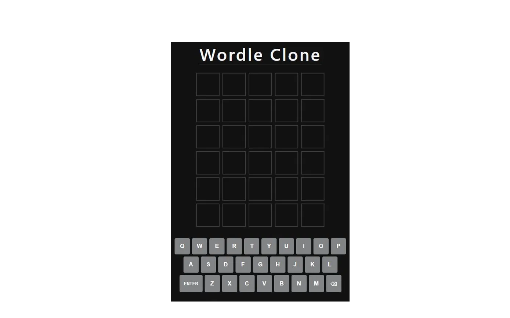
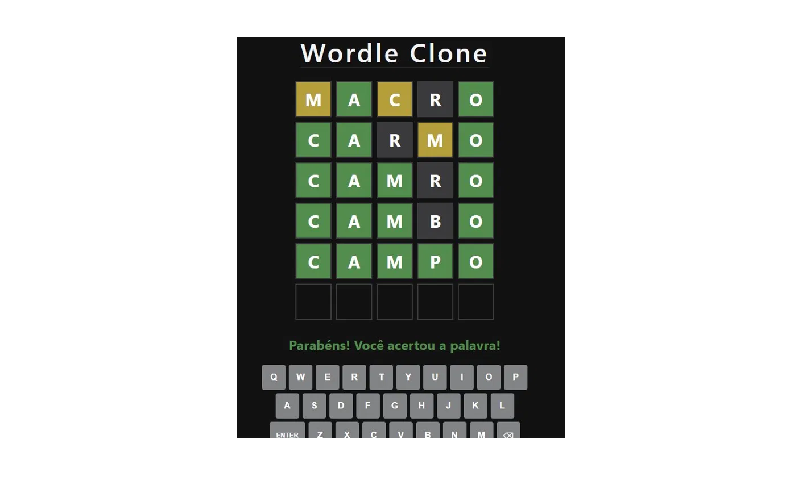
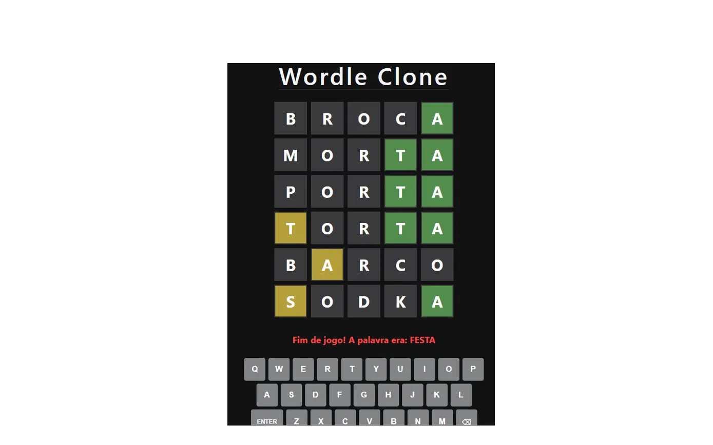

# 🟩 Wordle Clone

> Clone do famoso jogo de palavras Wordle, desenvolvido em React com palavras em português.

🔗 **[Jogar agora](https://app.netlify.com/projects/wordle-daluzcl/overview)** 

---

## 📸 Screenshots





---

## 🎮 Como jogar

- Você tem **6 tentativas** para adivinhar a palavra secreta de **5 letras**
- A cada tentativa as letras ficam coloridas:
  - 🟩 **Verde** — letra certa no lugar certo
  - 🟨 **Amarelo** — letra existe mas no lugar errado
  - ⬛ **Cinza** — letra não existe na palavra
- Use o teclado físico ou o teclado virtual na tela
- Uma nova palavra aleatória a cada partida

---

## ⚛️ Tecnologias

- **React** com Vite
- **useState** — gerenciamento de estado do jogo
- **useEffect** — captura de eventos do teclado
- **useCallback** — otimização de performance
- JavaScript puro para a lógica do jogo
- CSS inline com style props do React

---

## 🧩 Componentes

| Componente | Responsabilidade |
|------------|-----------------|
| `App.jsx` | Estado global e lógica do jogo |
| `Grade.jsx` | Grid 6x5 de tentativas |
| `Linha.jsx` | Cada linha de 5 letras |
| `Letra.jsx` | Célula individual com cor |
| `Teclado.jsx` | Teclado virtual QWERTY |
| `palavras.js` | Lista de palavras em português |

---

## 🚀 Como rodar localmente

```bash
# Clone o repositório
git clone https://github.com/DaluzCL/wordle-clone

# Entre na pasta
cd wordle-clone

# Instale as dependências
npm install

# Inicie o servidor de desenvolvimento
npm run dev
```

Acesse `http://localhost:5173` no browser.

---

## 👨‍💻 Autor

Desenvolvido por **DaluzCL** — aprendendo a codar construindo coisas reais.

[](https://github.com/DaluzCL)
